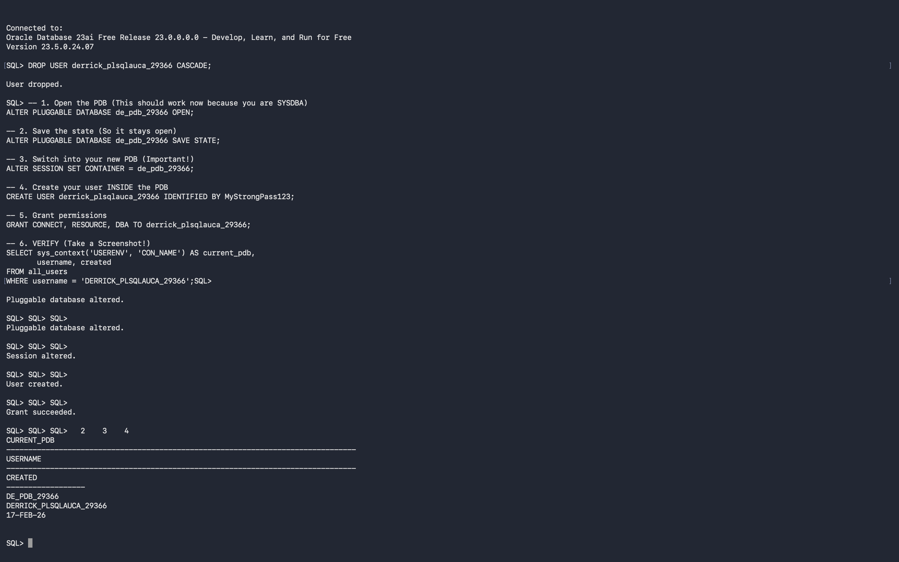
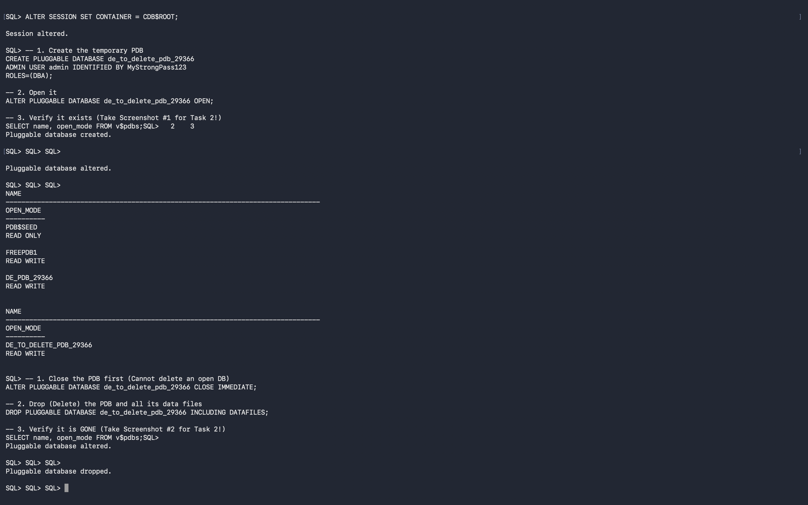
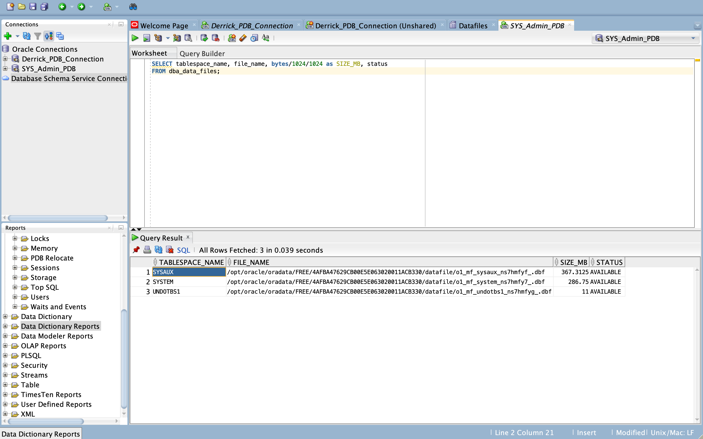

# Oracle Pluggable Database Assignment II

**Student Name:** Derrick
**Student ID:** 29366
**Repository Name:** oracle_pdb_ass_II_29366_derrick

## 📖 Overview
This repository documents the completion of Assignment II, focusing on Oracle Multitenant Architecture using Oracle Database 23ai Free.

## 🛠 Environment
- **Database:** Oracle Database 23ai Free
- **OS:** macOS
- **Tools:** SQL*Plus, SQL Developer

## 📝 Tasks

### Task 1: Create a New Pluggable Database
I successfully created a persistent Pluggable Database named **`DE_PDB_29366`** and a user **`derrick_plsqlauca_29366`** with DBA privileges.

**Evidence:**

---

### Task 2: Create and Delete a PDB
I created a temporary PDB named **`DE_TO_DELETE_PDB_29366`**, verified it was mounted, and then dropped it to demonstrate lifecycle management.

**Evidence:**

---

### Task 3: Oracle Enterprise Manager (OEM)
I accessed the OEM dashboard to verify the database status and performance metrics.

**Evidence:**

---
Final Checklist 
- ☑️ PDB names used
- ☑️User created inside the PDB
- ☑️Temporary PDB created and deleted
- ☑️OEM dashboard screenshot included
- ☑️GitHub repository is PUBLIC
- ☑️README is clear and professional
- ☑️Deadline respected

## 📜 Statement
I certify that this work is my own.
*Assignment completed on February 17, 2026.*
